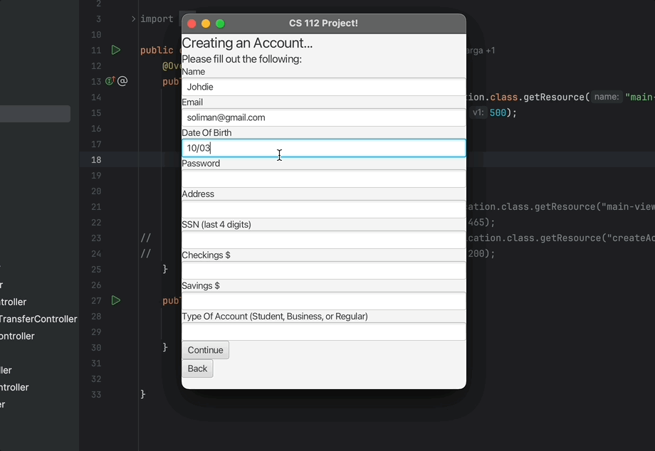
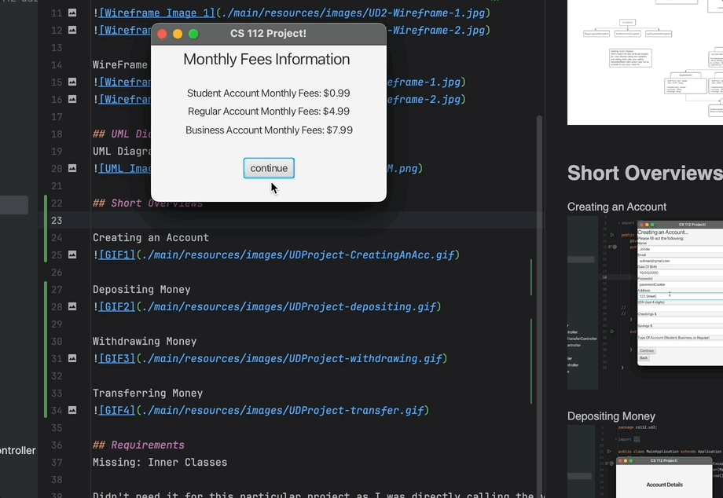
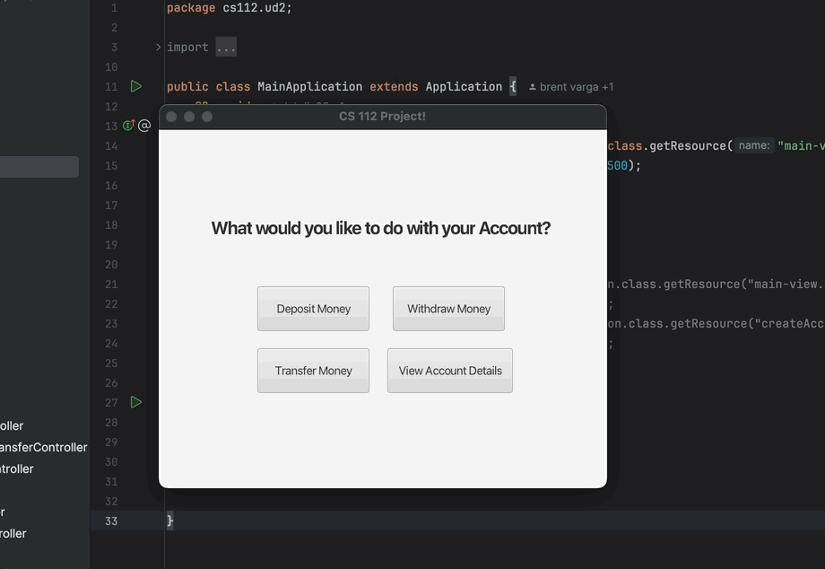
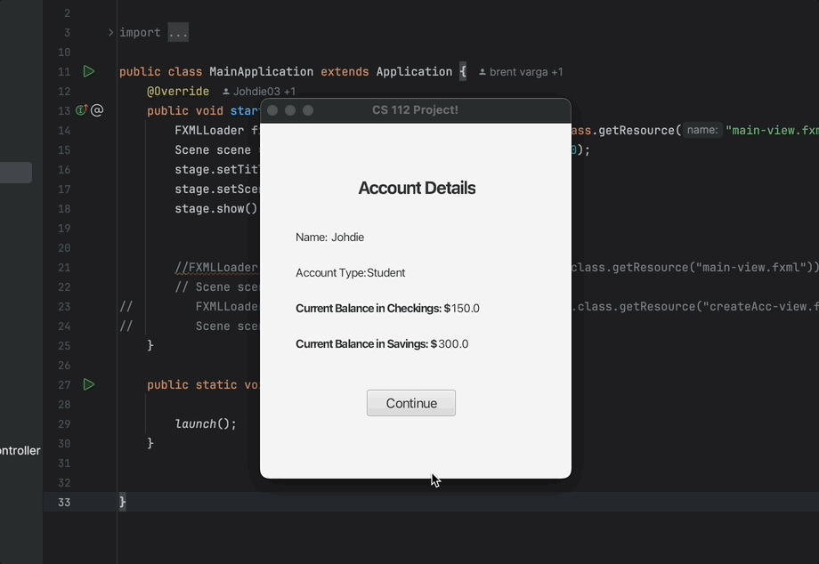
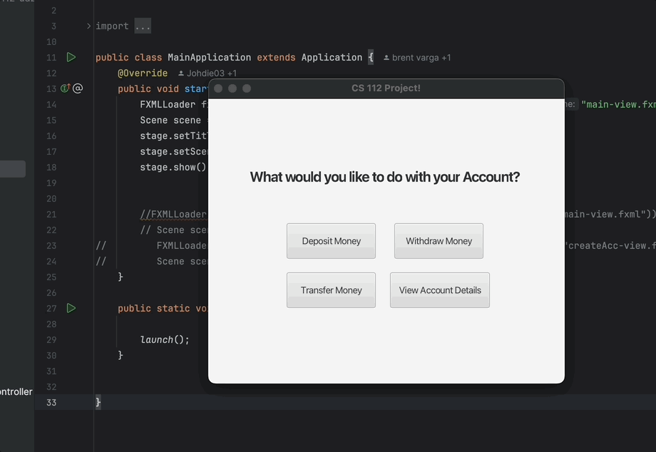

# Unit Deliverable 2 - Final Project GUI

Feel free to edit this file to contain a description of your project, as well as your GUI wireframe images. You can simply add them to your project directory and use a relative path, or upload them to [imgur](https://imgur.com/upload).

Use [Markdown](https://gist.github.com/cuonggt/9b7d08a597b167299f0d) to format appropriately.

## Bank System
This project has a similar concept to my previous capstone project from cs 111.
I wanted to see the Bank System I previously made as an actual interface (it was previously just from the terminal).
Which is why I made the decision to extend the project and integrate more actions, applying what I've learned from this course.

## GUI Wireframe
GUI Wireframe Images
WireFrame Version 1

WireFrame Version 2

## UML Diagram
UML Diagram Image

## Short Overviews
Creating an Account

Error with account creation (field left blank)
 

Depositing Money

Withdrawing Money

Transferring Money

## Requirements
Missing: Inner Classes
 
Didn't need it for this particular project as I was directly calling the variables and setting them also was calling variables/fields often which may not be suitable to use inner class for.

